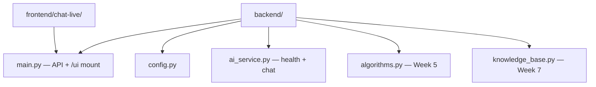

# Backend — Week 4 in progress (FastAPI + health + chat + HTML UI)

FastAPI backend on port **8000** with **`GET /health`**, **`POST /chat`** (Mistral direct, no RAG), and **HTML chat UI** at **`/ui/`**.

## Quick start

```powershell
python -m venv .venv
.venv\Scripts\Activate.ps1
pip install -r requirements.txt
uvicorn main:app --reload --app-dir backend
```

Verify:

```powershell
curl http://localhost:8000/health
```

- OpenAPI: http://localhost:8000/docs  
- Chat UI: http://localhost:8000/ui/

## Tests

```powershell
pytest tests/ -v
```

## Layout



See [../doc/developer/SETUP.md](../doc/developer/SETUP.md).
