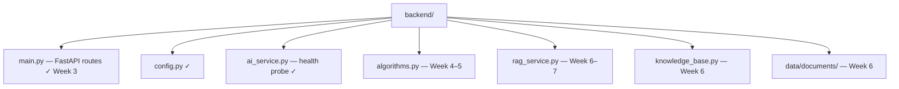

# Backend — Week 3 (FastAPI skeleton)

FastAPI backend is **operational** with `GET /health` on port **8000**. NBQ, change risk, and chat follow the roadmap in Weeks 4–8.

## Quick start

From the repository root:

```powershell
python -m venv .venv
.venv\Scripts\Activate.ps1
pip install -r requirements.txt
uvicorn main:app --reload --app-dir backend
```

Verify:

```powershell
curl http://localhost:8000/health
```

OpenAPI UI: http://localhost:8000/docs

## Run tests

```powershell
pytest tests/ -v
```

## Layout



## LM Studio

Start LM Studio on port **1234** before `/health` so the `ai.lm_studio` field reports `online`. If LM Studio is stopped, the API still returns `api: online` with `lm_studio.status: offline`.

See [../docs/developer/SETUP.md](../docs/developer/SETUP.md).

## API contract

See [../docs/developer/API.md](../docs/developer/API.md).
