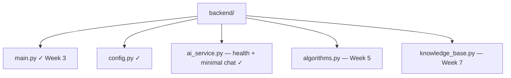

# Backend — Week 3 (FastAPI + health + minimal chat)

FastAPI backend on port **8000** with **`GET /health`** and **`POST /chat`** (Mistral direct, no RAG). Algorithms and knowledge base follow Weeks 5–7.

## Quick start

```powershell
python -m venv .venv
.venv\Scripts\Activate.ps1
pip install -r requirements.txt
uvicorn main:app --reload --app-dir backend
```

Verify:

```powershell
curl http://localhost:8000/health
curl -X POST http://localhost:8000/chat -H "Content-Type: application/json" -d "{\"messages\":[{\"role\":\"user\",\"content\":\"Hello\"}]}"
```

OpenAPI: http://localhost:8000/docs

## Tests

```powershell
pytest tests/ -v
```

## Layout



See [../doc/developer/SETUP.md](../doc/developer/SETUP.md).
