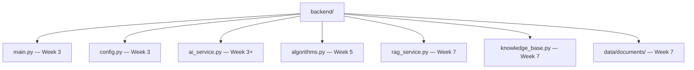

# Backend — Week 2 (structure planned)

Backend implementation starts **Week 3** in this repository.

## Planned layout

## Week 3 commitment

- FastAPI on port **8000**
- `GET /health` — API + LM Studio probe
- `POST /chat` — Mistral direct (minimal, no RAG)
- CORS for `localhost:3000`
- Initial pytest

See [../docs/developer/ROADMAP.md](../docs/developer/ROADMAP.md) and [../docs/developer/SETUP.md](../docs/developer/SETUP.md).

## API contract

[../docs/developer/API.md](../docs/developer/API.md)
