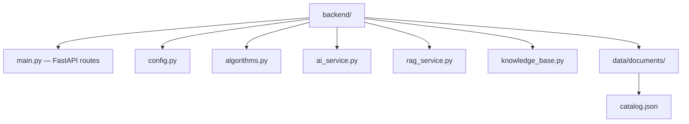

# Backend — Week 2 (structure planned)

Backend implementation starts **Week 3** in this repository.

## Planned layout

## API contract

See [../docs/developer/API.md](../docs/developer/API.md) — draft under Group 2 review.

## Architecture

See [../docs/developer/ARCHITECTURE.md](../docs/developer/ARCHITECTURE.md).
