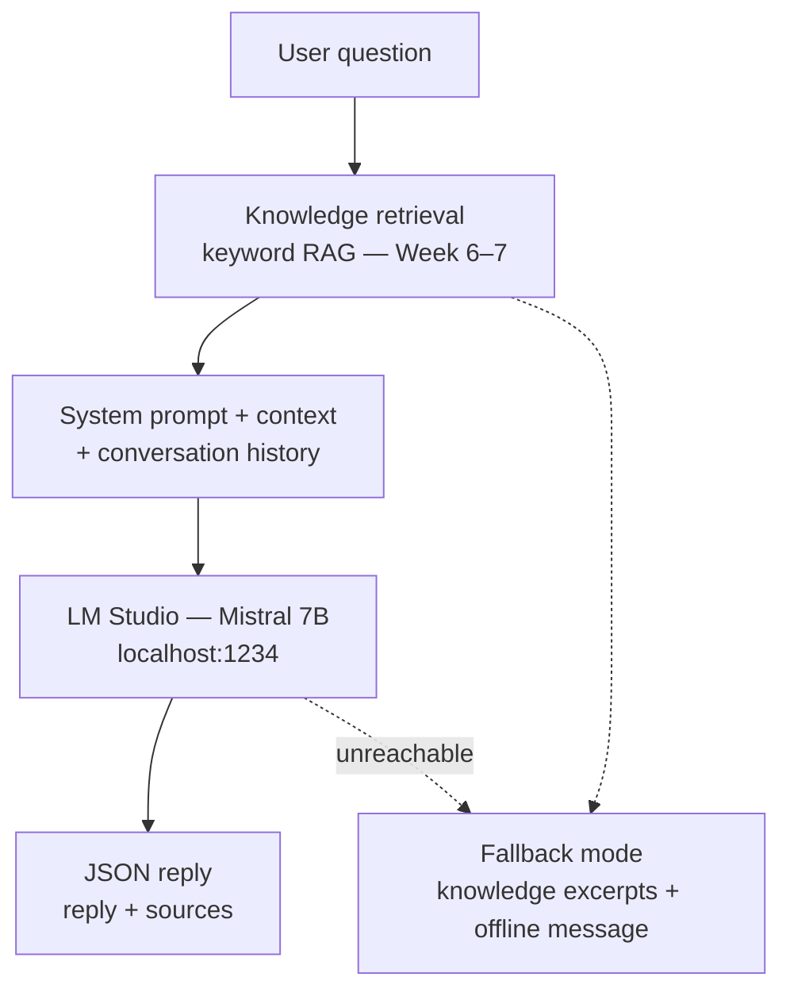

# AI Stack Decision — Week 2

**Document type:** Technology stack decision record  
**Status:** Decision made — LM Studio + Mistral 7B Instruct  
**Authors:** Hugo Davion & Axel Brazeau — Group 3

## Decision summary

| Layer | Selected | Implementation week |
|-------|----------|---------------------|
| Local LLM runtime | **LM Studio** (port 1234) | Week 2 (setup) · Week 3 (minimal `/chat`) · Week 7 (RAG + quality) |
| Chat model | **Mistral 7B Instruct** (GGUF) | Week 2 (download) |
| Retrieval | **Keyword RAG** (default) | Week 6–7 |
| Semantic embeddings | Optional (v2) | Deferred |

## Options compared (Week 2 workshop)

| Option | Pros | Cons | Decision |
|--------|------|------|----------|
| **LM Studio + Mistral** | Desktop UI, OpenAI-compatible API, good 7B quality | CPU inference slow (~30s–2min) | **Selected** |
| Ollama | CLI-friendly | Less visibility for demos | Rejected for POC |
| Rules-only / no LLM | Fast, deterministic | Poor natural language for chat | Fallback only |

## Planned architecture (RAG pipeline — Week 7)



If LM Studio is unreachable, the fallback path returns knowledge excerpts with a clear offline message.

## Chatbot knowledge scope (Week 2 definition)

The onboarding assistant will answer from:

- CGI onboarding, CI/CD, security, Git workflow, AMS intake topics  
- Change risk and NBQ concepts (algorithm-aware context in chat — Week 7+)  
- Sources cited in every answer when documentation is found (US-13)

**Future (v2):** relational onboarding database (US-15, US-16) replacing file-based `catalog.json`.

## Configuration (planned)

| Variable | Planned default |
|----------|-----------------|
| `LM_STUDIO_MODEL` | `auto` |
| `LM_STUDIO_TIMEOUT` | `300` |
| `SEMANTIC_RAG_ENABLED` | `false` |
| `AI_FALLBACK_ENABLED` | `true` |

## LM Studio readiness (Week 2 deliverable)

Installation steps: see [SETUP.md](SETUP.md).

Verification (Week 2):

```powershell
curl http://localhost:1234/v1/models
```

Expected: Mistral model listed and server running on port 1234.

Backend → LM Studio: **Week 3** (minimal `/chat`, no RAG) → **Week 7** (RAG, sources, fallback quality).
