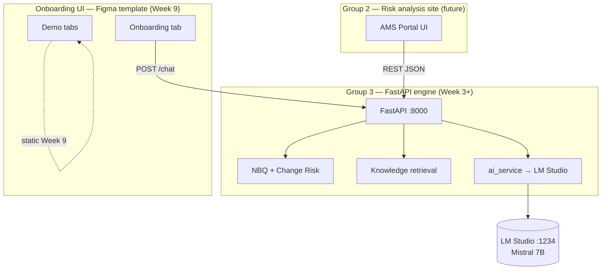
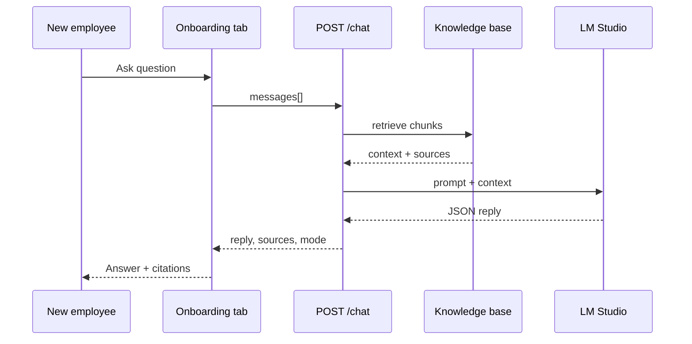
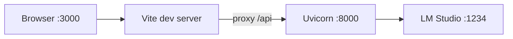

# Architecture diagrams

Visual reference for manager and Group 2 presentations. Implementation follows [ROADMAP.md](ROADMAP.md) from Week 3 onward.

## System context

## Chat request flow (Week 8+)

## Deployment view (developer POC)

## Phase timeline (aligned with roadmap)

| Weeks | Layer |
|-------|--------|
| 1–2 | Design, API contract, Figma, LM Studio — **done** |
| 3–4 | FastAPI, `/health`, minimal `/chat`, HTML chat UI |
| 5 | NBQ + Change Risk |
| 6 | G2 API route alignment |
| 7 | Knowledge base + RAG + chat quality |
| 8 | React Onboarding tab — **POC complete** |
| 9–11 | Stabilization, G2 live integration, final delivery |

See [ARCHITECTURE.md](ARCHITECTURE.md) for narrative detail.
