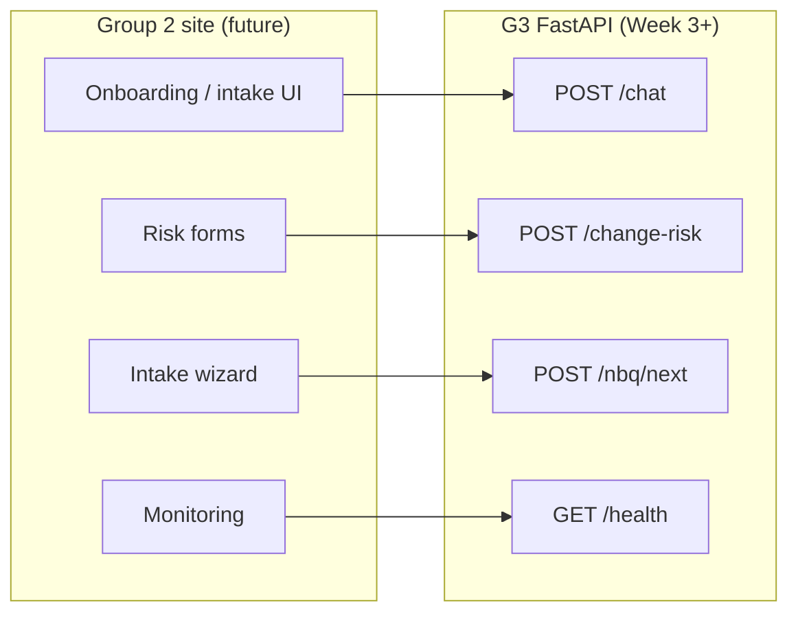

# Group 2 Integration — Draft (Week 2)

**Status:** Planning only — collaborating team **not yet in contact**.

See [ROADMAP.md](ROADMAP.md) for the full timeline.

## Integration milestones

| Week | Milestone |
|------|-----------|
| **2** | G3 publishes API contract draft (this repo) |
| **6** | Receive G2 API routes; map to G3 endpoints |
| **8** | G3 contracts frozen at v1.0 |
| **10** | Live G2 ↔ G3 integration testing |

## Planned integration model

## G2 routes — pending (Week 6 handover)

| G2 Route | Method | Maps to G3 |
|----------|--------|------------|
| _TBD_ | _TBD_ | _TBD_ |

Full contract: [API.md](API.md), [openapi-draft.yaml](openapi-draft.yaml).

## Decision-support scope

Change risk scores are **decision support only** — AMS leads retain final sign-off.
