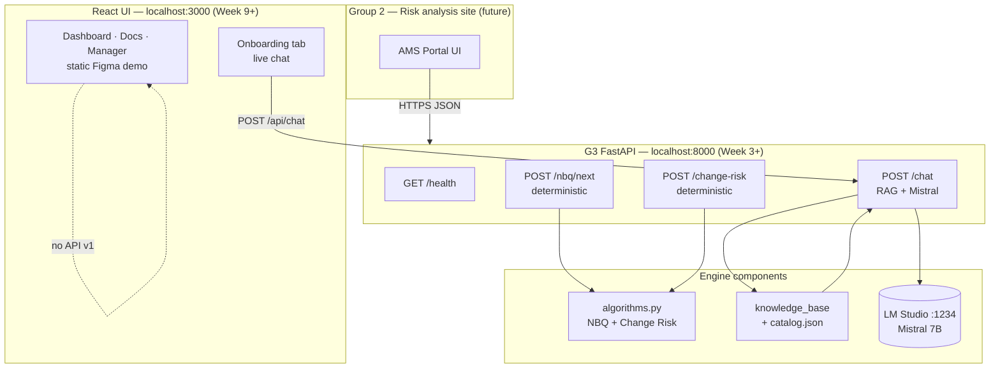
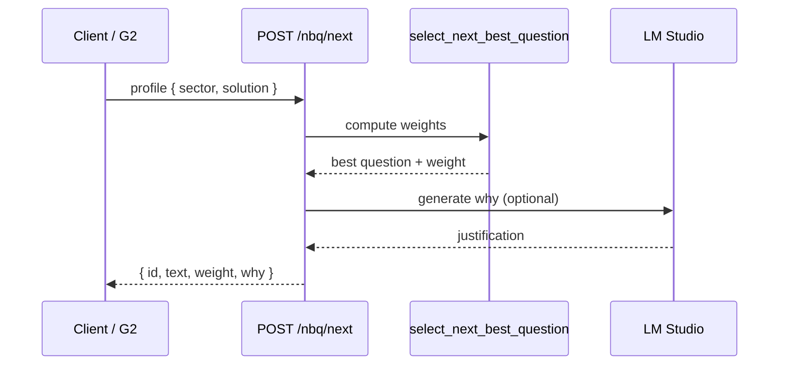
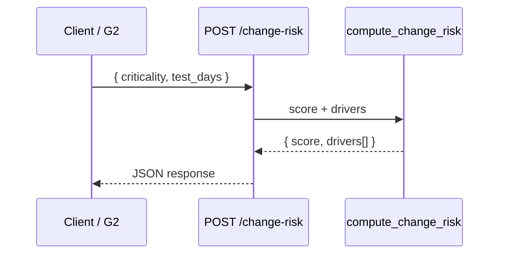
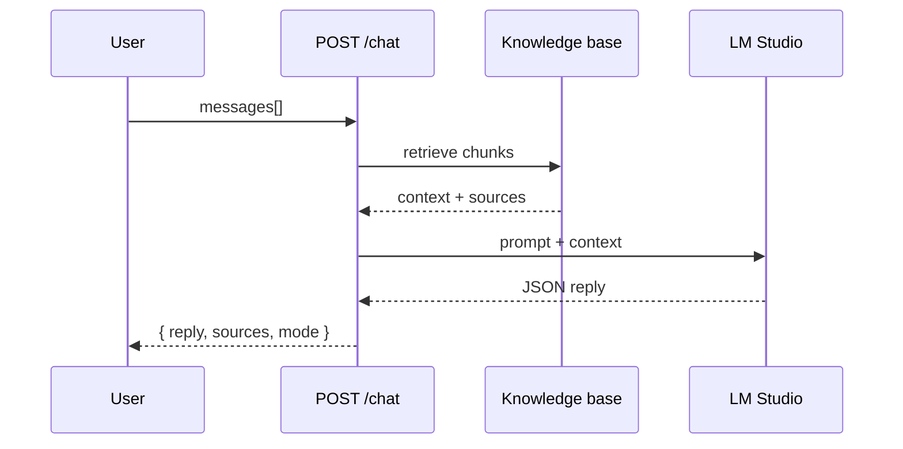

# Architecture — Group 3 AI Engine

**Document type:** Architecture note  
**Status:** Week 3 — FastAPI skeleton live; algorithms Weeks 4–8  
**Authors:** Hugo Davion & Axel Brazeau — Group 3

## 1. Purpose

Group 3 delivers an **algorithmic intelligence engine** for AMS intake:

- **Next-Best Question (NBQ)** — prioritize intake questions by client profile  
- **Change Risk** — score 0–100 with auditable drivers (decision support only)  
- **Onboarding chat** — answer CGI process questions with cited sources  

Group 2 owns the wider risk analysis site and will call G3 REST APIs.

## 2. High-level architecture

See also [ARCHITECTURE_DIAGRAM.md](ARCHITECTURE_DIAGRAM.md) for sequence and deployment views.

## 3. Design principles

| Principle | Rationale |
|-----------|-----------|
| **Deterministic algorithms** | NBQ and Change Risk are pure Python — reproducible for audit |
| **LLM for language only** | Mistral explains answers and NBQ `why` field; does not own scoring |
| **Local AI** | LM Studio on developer machine — no cloud API keys for POC |
| **RAG before generation** | Retrieve CGI knowledge chunks, inject into prompt, cite sources |
| **Fallback path** | If Mistral offline, return knowledge excerpts + clear message |
| **API-first** | Group 2 integrates via OpenAPI-documented JSON, not shared codebase |

## 4. Component responsibilities

### 4.1 FastAPI layer (`main.py` — Week 3+)

- HTTP routing, Pydantic validation, CORS for `localhost:3000`  
- Delegates algorithms to `algorithms.py`, chat to `ai_service.py`  
- OpenAPI at `/docs` for Group 2

### 4.2 Algorithms (`algorithms.py` — Week 4–5)

**NBQ:** weighted question pool; sector boost (e.g. Healthcare + security +50).  
**Change Risk:** `score = max(0, base_criticality - test_days × 5)`.

### 4.3 Knowledge & RAG (Week 6–7)

- Curated topics + `catalog.json` chunks (Week 6)  
- Keyword retrieval default; optional semantic embeddings (v2)  
- Future: relational database (Group 1) per US-15 / US-16

### 4.4 AI service (Week 7–8)

- Build system prompt + retrieved context  
- Call LM Studio OpenAI-compatible API  
- Parse JSON reply with `reply` + `sources`  
- Inject live algorithm context for risk/NBQ questions

### 4.5 Onboarding UI (Week 9)

- Single live chat on **Onboarding** tab  
- Show sources, answer mode, pipeline status (US-07, US-13)

## 5. Data flows

### NBQ request (Week 4+)

### Change Risk request (Week 5+)

### Chat request (Week 8+)

## 6. Technology stack (decided Week 2)

| Layer | Choice |
|-------|--------|
| Backend | Python 3.10+, FastAPI, Pydantic, Uvicorn |
| Algorithms | Pure Python |
| Local LLM | LM Studio + Mistral 7B Instruct |
| RAG | Keyword search (default); semantic optional v2 |
| Frontend | React, TypeScript, Vite, Tailwind (Figma template) |
| Repository | GitHub — https://github.com/hodncgi/AMS |

See [AI.md](AI.md) for stack comparison and LM Studio setup.

## 7. Security & scope boundaries

- POC runs on localhost; production auth/TLS is Group 2 responsibility  
- Change risk is **decision support** — AMS leads retain sign-off  
- No merge into Group 2 site in v1 — REST integration only

## 8. Next steps (Week 4)

1. Implement `POST /nbq/next` in `algorithms.py`  
2. Add NBQ unit tests  
3. Wire NBQ route in `main.py`  
4. Draft Phase B progress report (Backend & NBQ)
