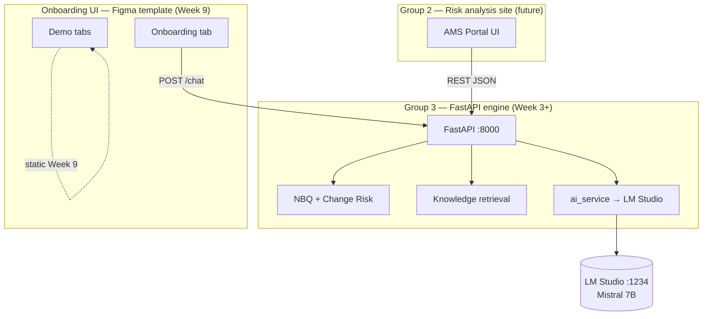
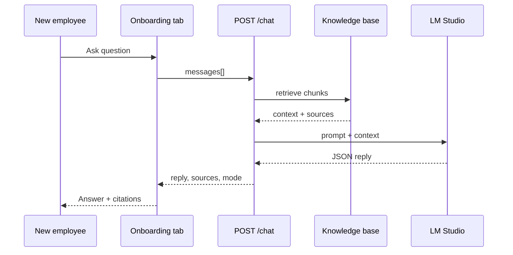
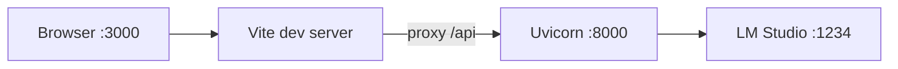

# Architecture diagrams (Week 2)

Visual reference for manager and Group 2 presentations. Implementation follows in Weeks 3–9.

## System context

## Chat request flow (Week 8+)

## Deployment view (developer POC)

## Phase timeline (aligned with roadmap)

| Weeks | Layer |
|-------|--------|
| 1–2 | Design, API contract, Figma analysis, LM Studio |
| 3 | FastAPI + `/health` |
| 4–5 | NBQ + Change Risk |
| 6–7 | Knowledge base + RAG |
| 8 | `/chat` |
| 9 | Figma → React Onboarding tab |

See [ARCHITECTURE.md](ARCHITECTURE.md) for narrative detail.
