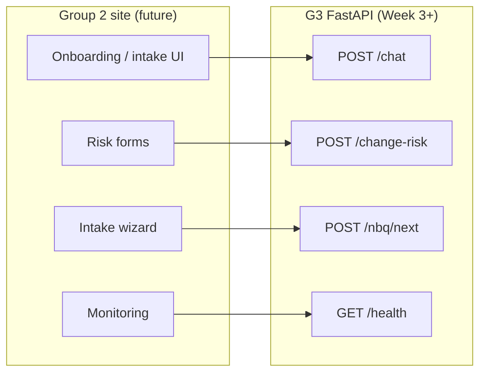

# Group 2 Integration — Draft (Week 2)

**Status:** Planning only — Group 2 site API routes pending.

G3 delivers the algorithmic engine; Group 2 owns the risk analysis site UI.

## Planned integration model

## Contracts

See [API.md](API.md) — draft JSON shapes for Group 2 review this week.

## Information needed from Group 2

1. Base URL and authentication  
2. CORS / allowed origins for production  
3. Field mapping for change risk and NBQ forms  
4. Timeline for integration testing (roadmap Week 10)

## Scope

- No site merge in v1 — REST calls only  
- Change risk scores are decision support; AMS leads retain sign-off
