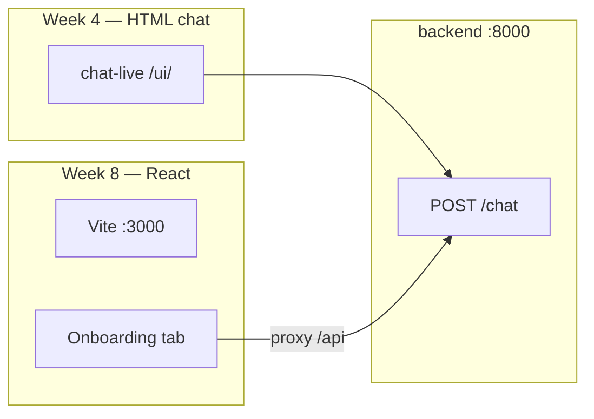

# Frontend

## Design preview (Week 2 — complete)

**[design-preview/index.html](design-preview/index.html)** — static mockup from the manager Figma template.

## Live HTML chat (Week 4 — in progress)

**[chat-live/index.html](chat-live/index.html)** — browser chat wired to `POST /chat`.

Start the backend, then open **http://localhost:8000/ui/**

| Feature | Status |
|---------|--------|
| Message history → `/chat` | In progress |
| Suggested starter questions (US-02) | In progress |
| Health badge | In progress |

## Planned timeline

| Week | Deliverable |
|------|-------------|
| **4** | HTML chat page wired to `POST /chat` |
| **8** | React app (Figma → Onboarding tab live) |

See [../doc/developer/ROADMAP.md](../doc/developer/ROADMAP.md) and [../doc/design/FIGMA_TEMPLATE_REVIEW.md](../doc/design/FIGMA_TEMPLATE_REVIEW.md).
