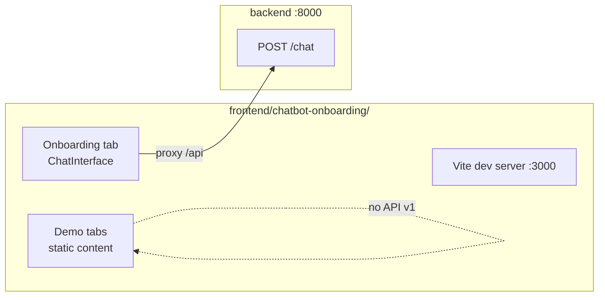

# Frontend — Week 2

## Design preview (Week 2 deliverable)

**[design-preview/index.html](design-preview/index.html)** — static mockup from the manager Figma template. Open in any browser.

## React application (Week 9)

Planned stack: React, TypeScript, Vite, shadcn/ui from Figma template.

See [../docs/design/FIGMA_TEMPLATE_REVIEW.md](../docs/design/FIGMA_TEMPLATE_REVIEW.md).
