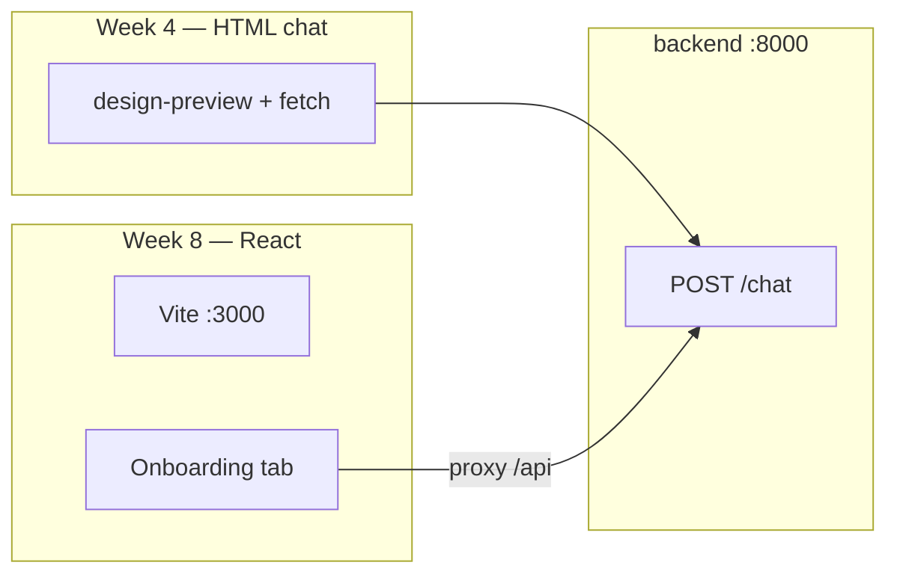

# Frontend — Week 2

## Design preview (Week 2 deliverable)

**[design-preview/index.html](design-preview/index.html)** — static mockup from the manager Figma template. Open in any browser.

## Planned timeline

| Week | Deliverable |
|------|-------------|
| **4** | HTML chat page wired to `POST /chat` |
| **8** | React app (Figma → Onboarding tab live) |

See [../docs/developer/ROADMAP.md](../docs/developer/ROADMAP.md) and [../docs/design/FIGMA_TEMPLATE_REVIEW.md](../docs/design/FIGMA_TEMPLATE_REVIEW.md).
